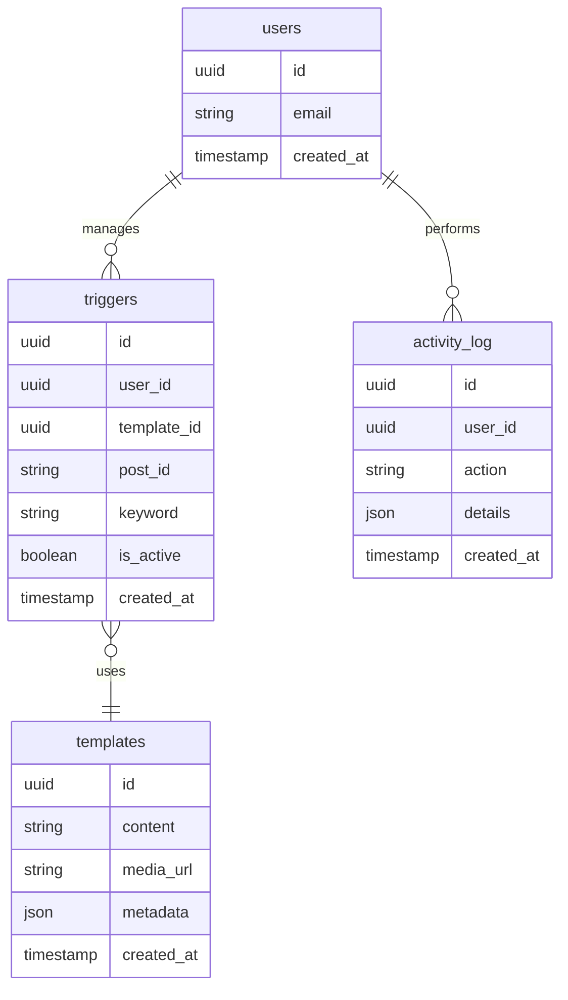

# Database Schema

## Tables Overview


## Table Details

### `users` (Supabase Auth)
- Extends default Supabase auth.users table
- Stores admin panel users
- **Relationships**:
  - Has many `triggers`
  - Has many `activity_log` entries

### `triggers`
- Stores Instagram post/keyword configurations
- **Fields**:
  - `post_id`: Instagram post ID to monitor
  - `keyword`: Trigger word/phrase
  - `is_active`: Enable/disable toggle
- **Indexes**:
  - `idx_triggers_post_id` (post_id)
  - `idx_triggers_keyword` (keyword)

### `templates`
- Stores DM response content
- **Fields**:
  - `content`: Message text (supports variables)
  - `media_url`: Optional image/video URL
  - `metadata`: Additional config (e.g., buttons)
  
### `activity_log`
- Tracks system events
- **Fields**:
  - `action`: Event type (e.g., "dm_sent")
  - `details`: JSON payload with context

## Sample Queries

1. Get active triggers for a post:
```sql
SELECT * FROM triggers 
WHERE post_id = 'INSTAGRAM_POST_ID' 
AND is_active = true;
```

2. Get template for a keyword:
```sql
SELECT t.* FROM templates t
JOIN triggers tr ON tr.template_id = t.id
WHERE tr.keyword = 'WIN'
LIMIT 1;
```

3. Recent admin activity:
```sql
SELECT * FROM activity_log
WHERE user_id = 'ADMIN_UUID'
ORDER BY created_at DESC
LIMIT 10;